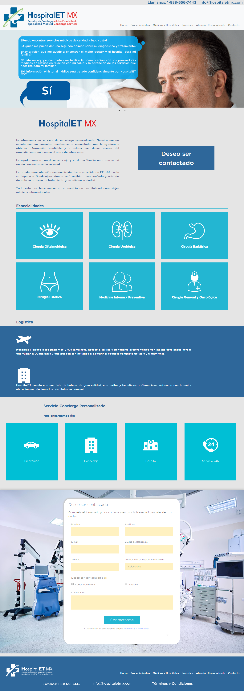
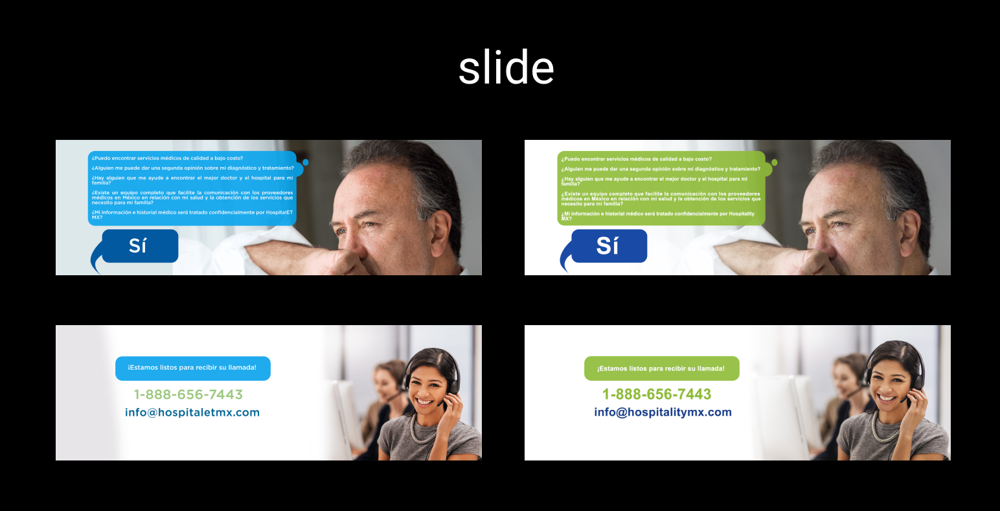
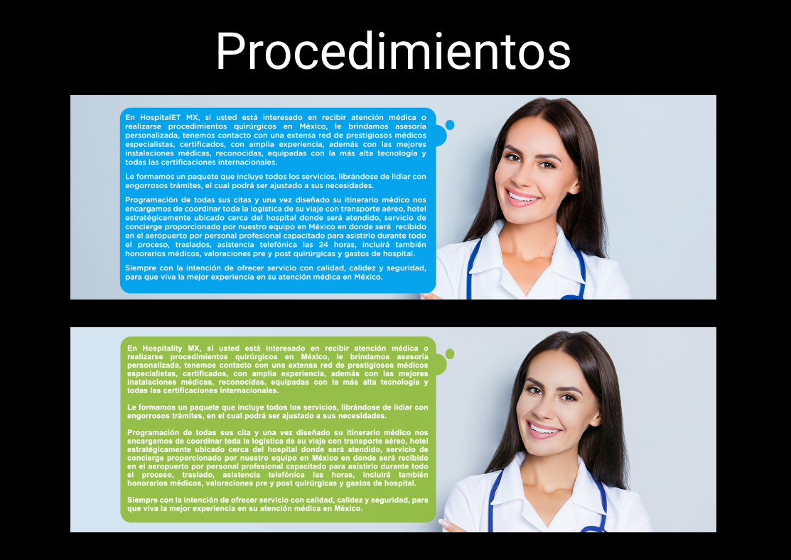
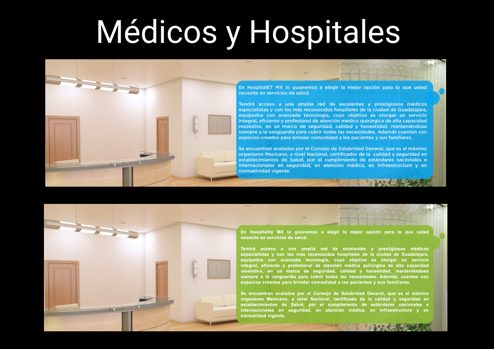
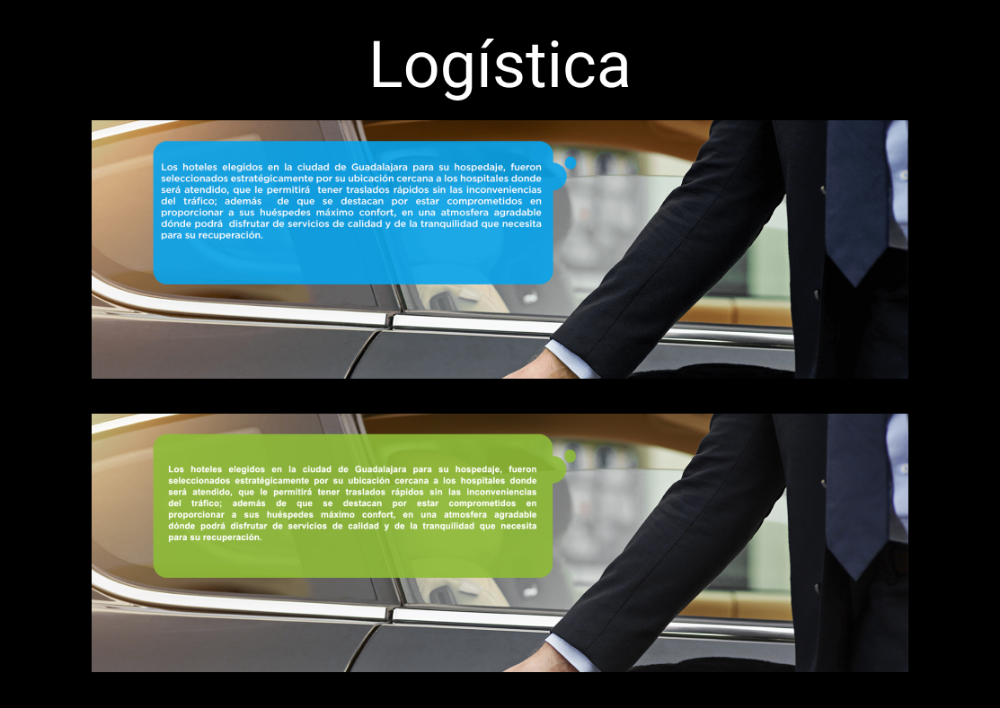
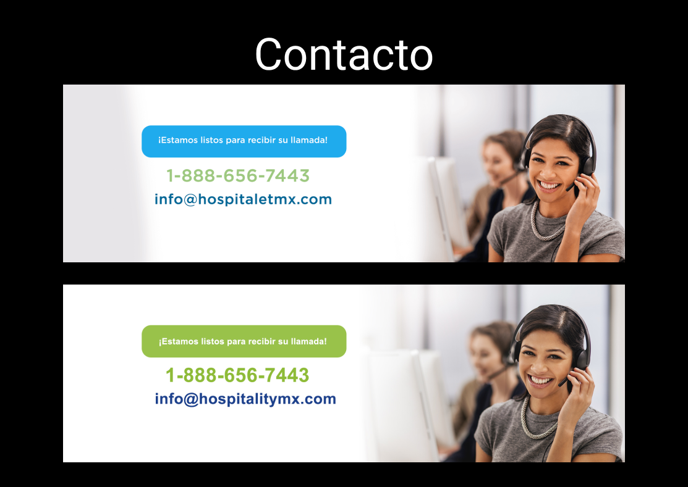
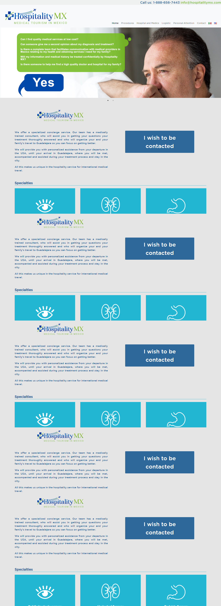

#HospitalityMx

### hospitalitymx

Es una sitio web enfocada al Turismo médico de Estados Unidos a México que tiene como objetivo recibir más pacientes estadounidenses que buscan atención medica a un costo menor y de calidad.

Ofrece los siguientes servicios:
* Médicos Especialistas.
* Hospitales de prestigio.
* Traslado <strong>*Aeropuerto-hotel-hospital*</strong>.

### Objetivos del Proyecto:

Obtimizar el sitio web de hospitalETMx a HospitalityMx, relizando Cambios en logo, sustituir imágenes y copy, Actualizar Información de contacto, con el objetivo de aumentar el trafico al sitio y hacer más amigable para el usuario final.

## Sitio HospitalETMx

Versión anterios del Sitio.

## Actualizar Logo e Información de Contacto.  

Se sustituyó el Logo en WordPress utilizando código html.

## Actualizar imágenes del sitio web versión en Español.  

En la sección inicio, se sustituyeron imágenes del slide en WordPress utilizando código html.

En la sección Procedimienros se sustituyó imágen, en WordPress utilizando código html.

En la sección Médicos y Hospitales se sustituyó imágen, en WordPress utilizando código html.

En la sección Logística se sustituyó imágen, en WordPress utilizando código html.

En la sección Contacto se sustituyó imágen, en WordPress utilizando código html.

## Sitio web en versión Inglés.

* Se sustituyeron imágenes, en WordPress utilizando código html.
* Se agregaron los nuevos copy's en inglés en cada una de las secciones del sitio web.

## Equipo:

#### Diseñadora: Edith Balbuena
#### Traducción de copy: Luis Palestino
#### Frond-end: Nancy Santana
#### Programado Backend: Mario Mayorga

[Versión Actual del sitio HospitalityMx](http://hospitalitymx.com/)
